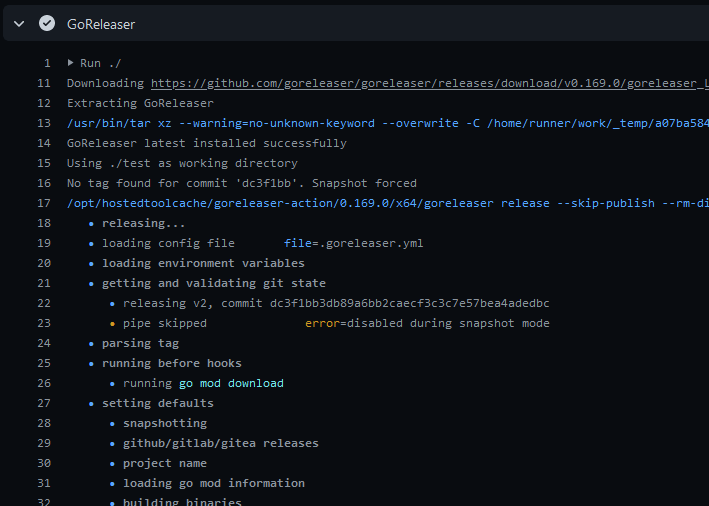

<p align="center">
  
  <h3 align="center">GoReleaser Action</h3>
  <p align="center"><a href="https://github.com/features/actions">GitHub Action</a> for GoReleaser</p>
  <p align="center">
    <a href="https://github.com/goreleaser/goreleaser-action/releases/latest"></a>
    <a href="https://github.com/marketplace/actions/goreleaser-action"></a>
    <a href="https://github.com/goreleaser/goreleaser-action/actions?workflow=test"></a>
    <a href="https://codecov.io/gh/goreleaser/goreleaser-action"></a>
    <a href="https://github.com/sponsors/crazy-max"></a>
  </p>
</p>

___



* [Usage](#usage)
  * [Workflow](#workflow)
  * [Run on new tag](#run-on-new-tag)
  * [Signing](#signing)
  * [Upload artifacts](#upload-artifacts)
  * [Install Only](#install-only)
* [Customizing](#customizing)
  * [inputs](#inputs)
  * [environment variables](#environment-variables)
* [Limitation](#limitation)
* [Development](#development)
* [License](#license)

## Usage

### Workflow

```yaml
name: goreleaser

on:
  pull_request:
  push:

jobs:
  goreleaser:
    runs-on: ubuntu-latest
    steps:
      -
        name: Checkout
        uses: actions/checkout@v2
        with:
          fetch-depth: 0
      -
        name: Set up Go
        uses: actions/setup-go@v2
        with:
          go-version: 1.15
      -
        name: Run GoReleaser
        uses: goreleaser/goreleaser-action@v2
        with:
          version: latest
          # distribution: goreleaser-pro # Uncomment if using GoReleaser Pro
          args: release --rm-dist
        env:
          GITHUB_TOKEN: ${{ secrets.GITHUB_TOKEN }}
          # GORELEASER_KEY: ${{ secrets.GORELEASER_KEY }} # Uncomment if using GoReleaser Pro
```

> **IMPORTANT**: note the `fetch-depth: 0` input in `Checkout` step. It is required  for the changelog to work correctly.

### Run on new tag

If you want to run GoReleaser only on new tag, you can use this event:

```yaml
on:
  push:
    tags:
      - '*'
```

Or with a condition on GoReleaser step:

```yaml
      -
        name: Run GoReleaser
        uses: goreleaser/goreleaser-action@v2
        if: startsWith(github.ref, 'refs/tags/')
        with:
          version: latest
          args: release --rm-dist
        env:
          GITHUB_TOKEN: ${{ secrets.GITHUB_TOKEN }}
```

> For detailed instructions please follow GitHub Actions [workflow syntax](https://help.github.com/en/articles/workflow-syntax-for-github-actions#About-yaml-syntax-for-workflows).

### Signing

If [signing is enabled](https://goreleaser.com/customization/#Signing) in your GoReleaser configuration, you can use the [Import GPG](https://github.com/crazy-max/ghaction-import-gpg) GitHub Action along with this one:

```yaml
      -
        name: Import GPG key
        id: import_gpg
        uses: crazy-max/ghaction-import-gpg@v3
        with:
          gpg-private-key: ${{ secrets.GPG_PRIVATE_KEY }}
          passphrase: ${{ secrets.PASSPHRASE }}
      -
        name: Run GoReleaser
        uses: goreleaser/goreleaser-action@v2
        with:
          version: latest
          args: release --rm-dist
        env:
          GITHUB_TOKEN: ${{ secrets.GITHUB_TOKEN }}
          GPG_FINGERPRINT: ${{ steps.import_gpg.outputs.fingerprint }}
```

And reference the fingerprint in your signing configuration using the `GPG_FINGERPRINT` environment variable:

```yaml
signs:
  - artifacts: checksum
    args: ["--batch", "-u", "{{ .Env.GPG_FINGERPRINT }}", "--output", "${signature}", "--detach-sign", "${artifact}"]
```

### Upload artifacts

For some events like pull request or schedule you might want to store the artifacts somewhere for testing
purpose. You can do that with the [actions/upload-artifact](https://github.com/actions/upload-artifact) action:

```yaml
      -
        name: Run GoReleaser
        uses: goreleaser/goreleaser-action@v2
        with:
          version: latest
          args: release --rm-dist
        env:
          GITHUB_TOKEN: ${{ secrets.GITHUB_TOKEN }}
      -
        name: Upload assets
        uses: actions/upload-artifact@v2
        with:
          name: myapp
          path: dist/*
```

### Install Only

```yaml
steps:
  -
    name: Install GoReleaser
    uses: goreleaser/goreleaser-action@v2
    with:
      install-only: true
  -
    name: Show GoReleaser version
    run: goreleaser -v
```

## Customizing

### inputs

Following inputs can be used as `step.with` keys

| Name             | Type    | Default   | Description                               |
|------------------|---------|-----------|-------------------------------------------|
| `version`**¹**   | String  | `latest`  | GoReleaser version                        |
| `args`           | String  |           | Arguments to pass to GoReleaser           |
| `workdir`        | String  | `.`       | Working directory (below repository root) |
| `install-only`   | Bool    | `false`   | Just install GoReleaser                   |

> **¹** Can be a fixed version like `v0.117.0` or a max satisfying semver one like `~> 0.132`. In this case this will return `v0.132.1`.

### environment variables

Following environment variables can be used as `step.env` keys

| Name           | Description                           |
|----------------|---------------------------------------|
| `GITHUB_TOKEN` | [GITHUB_TOKEN](https://help.github.com/en/actions/configuring-and-managing-workflows/authenticating-with-the-github_token) as provided by `secrets` |

## Limitation

`GITHUB_TOKEN` permissions [are limited to the repository](https://help.github.com/en/actions/configuring-and-managing-workflows/authenticating-with-the-github_token#about-the-github_token-secret)
that contains your workflow.

If you need to push the homebrew tap to another repository, you must therefore create a custom [Personal Access Token](https://help.github.com/articles/creating-a-personal-access-token-for-the-command-line/)
with `repo` permissions and [add it as a secret in the repository](https://help.github.com/en/actions/automating-your-workflow-with-github-actions/creating-and-using-encrypted-secrets). If you create a
secret named `GH_PAT`, the step will look like this:

```yaml
      -
        name: Run GoReleaser
        uses: goreleaser/goreleaser-action@v2
        with:
          version: latest
          args: release --rm-dist
        env:
          GITHUB_TOKEN: ${{ secrets.GH_PAT }}
```

## Development

```
# format code and build javascript artifacts
docker buildx bake pre-checkin

# validate all code has correctly formatted and built
docker buildx bake validate

# run tests
docker buildx bake test
```

## License

MIT. See `LICENSE` for more details.
